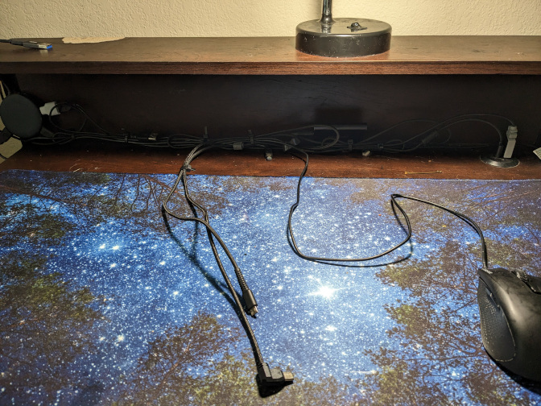

+++
title = 'Chairs and Creating the best environment for you'
date = 2023-02-15T00:00:00-00:00
draft = false
tags = ['Tech', 'Desk']
+++

I recently got a new chair, and it made me start to think about ergonomics a lot more.

<!--more-->

Overall, it's great. The mesh back allows for a lot of airflow, there's fantastic back support, and there's also retractable armrests.

For something that I got on deal for $30, I think it was more than a good bargain, especially compared to the Wish Chair From Hell that costs around the same.

However, there's only one type of chair I think would be worse...

## Gaming chairs are NOT good!
(and here's why)

Gaming chairs, because they take direct inspiration off of racing car seats, or bucket seats, they are designed to preserve a human in the case of a crash.
They are designed to protect against large and sudden G-Forces, not for comfort or even for ergonomics.

Bucket seats are designed so that you would tense up, especially around your shoulders, when mixed with the chest breathing technique, which a lot of people don't even know is a terrible way to breath, means that you are making yourself more and more uncomfortable just by sitting on a chair.

## Ergonomics VS Comfort, A Battle of Frenemies

Truth is, I have a ridiculously small desk.
It's dimentions are 31x18.5 inches, and sans an elevated platform at the back, there really isn't anything special about this desk, however what's creativity without restrictions?

With a deskmat, Mechanical Keyboard, some games, maybe a plushy or two, a CD Player, and a bunch of other bits and bops, it really does start to feel like home.

Notice the large space between the mouse and the keyboard. This was intenionally done to prevent Carpal Tunnel, through minimizing as many intersections my arms have to deal with on a regular basis.

The position of my laptop is a deliberate choice, as to prevent neckpain. Proper office ergonomics states that you shouldn't have to move your head down to look at your screen.

The elevated platform is simply a convienent alternative to the advised laptop stand in the diagram above

I find that comfort isn't just a physical state, but a mental state as well. If you're comfortable both physically and mentally, you will overall perform better at any task that you set yourself out to complete.
